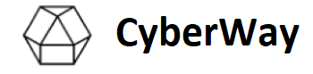

*****  
# CyberWay — the Most Powerful Infrastructure for Decentralized Applications

**Welcome to the CyberWay source code repository! CyberWay is a EOS fork with some major improvements.**  

[](https://buildkite.com/cyberway)
[](https://github.com/cyberway/cyberway/blob/master/LICENSE)

Welcome to the CyberWay source code repository! This software enables businesses to rapidly build and deploy blockchain-based applications.

*****  
## Official Testnet

[testnet.cyberway](https://docs.cyberway.io/validators/testnet_installation)

## Supported Operating Systems

CyberWay currently supports the following operating systems:  

1. Ubuntu 16.04
2. Ubuntu 18.04
3. MacOS Darwin 10.12 (or later versions)
4. CentOS 7
5. Fedora 25 (or later version)
6. Mint 18

---

> **Note:**  
> It may be possible to install CyberWay on other Unix-based operating systems.

---

## Getting Started

We appreciate your interest in contributing to the CyberWay platform! We always welcome contributions from our community to make our code and docs better.

For newcomers to CyberWay, it is recommended first to read the manuals [Creating Wallet and Keys for Development](https://cyberway.gitbook.io/en/devportal/create_development_wallet) and [Mainnet. Installation Guide](https://docs.cyberway.io/validators/mainnet_connection). An advanced developer or a validator may need the following steps.

### To install CyberWay
1. Clone CyberWay sources. The latest CyberWay version is [v2.0.3](https://github.com/cyberway/cyberway/releases/tag/v2.0.3).

2. Run the node:
```
./start_light.sh
```

### To upgrade CyberWay from v2.0.2 to v2.0.3

1. Download the docker image `cyberway/cyberway:v2.0.3`:
```
sudo docker pull cyberway/cyberway:v2.0.3
```

2. Download the last version of `docker-compose.yml` from the [GitHub](https://raw.githubusercontent.com/cyberway/cyberway.launch/master/docker-compose.yml)

```
sudo curl https://raw.githubusercontent.com/cyberway/cyberway.launch/master/docker-compose.yml --output /var/lib/cyberway/docker-compose.yml
```

3. Restart the nodeos container:
```
cd /var/lib/cyberway
sudo env EXTRA_NODEOS_ARGS="--replay-blockchain" docker-compose up -t 120 -d
```

## More information about CyberWay

* [White Paper](https://cyberway.gitbook.io/en/users/white_paper)
* [Main features of CyberWay](https://cyberway.gitbook.io/en/users/cyberway_features)
* [Bandwidth differences between EOS and CyberWay](https://cyberway.gitbook.io/en/users/bandwidth_differences)
* [Bandwidth implementation](https://cyberway.gitbook.io/en/users/bandwidth_implementation)

## Devportal

* [Testnet. Installation Guide for Validators](https://cyberway.gitbook.io/en/validators/testnet_installation)
* [Mainnet. Installation Guide](https://docs.cyberway.io/validators/mainnet_connection)
* [Creating Wallet and Keys for Development](https://cyberway.gitbook.io/en/devportal/create_development_wallet)
* [Guide to Creating and Deploying an Application on CyberWay](https://cyberway.gitbook.io/en/devportal/create_application)
* [System Smart Contracts](https://cyberway.gitbook.io/en/devportal/system_contracts)
* [Application Smart Contracts](https://cyberway.gitbook.io/en/devportal/application_contracts)
* [The Cyberway Wallet designed for the Bittrex Market](https://cyberway.gitbook.io/en/devportal/cyberway_wallet_for_bittrex)
* [The Event Model](https://cyberway.gitbook.io/en/devportal/event_engine)

## Community

**Telegram:**  
* CyberWay - https://t.me/cyberway_en (for general questions and inquiries)
* CyberWay Validators - https://t.me/cyberway_validators_en (for questions and inquiries concerning validators of CyberWay platform)
* CyberWay Dev - https://t.me/cyberway_dev (for instant technical feedback from our Dev team)

**Twitter:**  
* We'll keep you updated over https://twitter.com/cyberwayio

